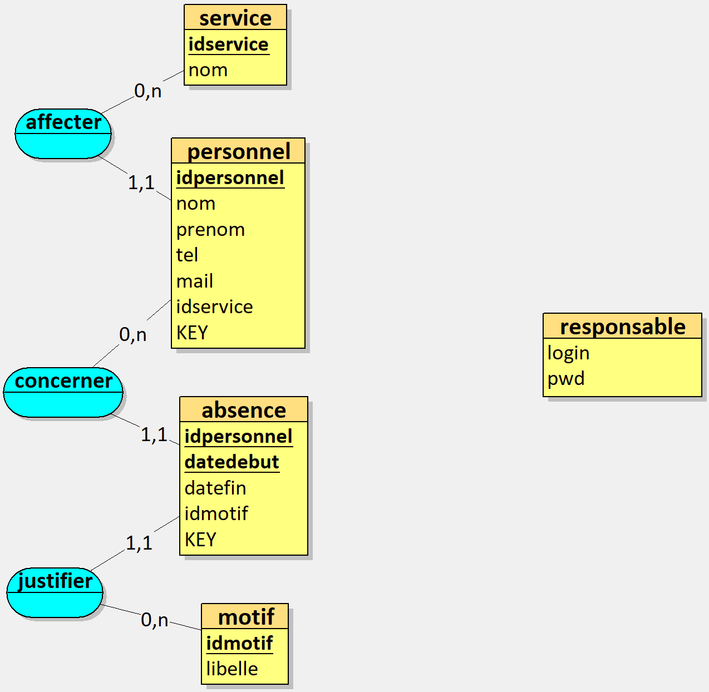
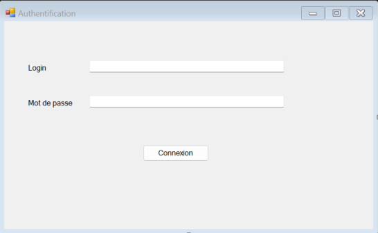
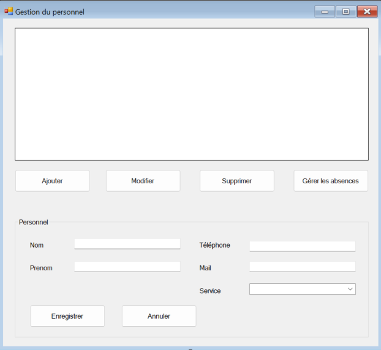
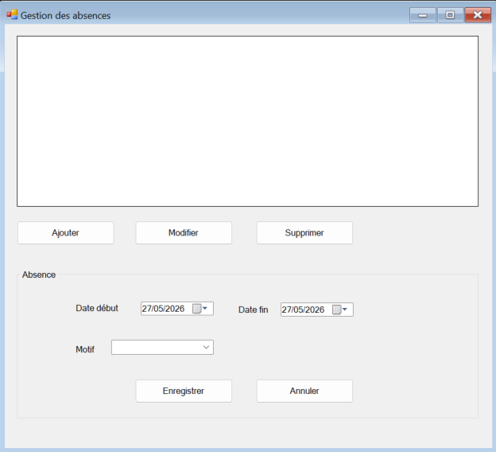
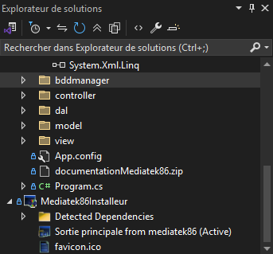

# Application MediaTek86

Application C# écrite sous Visual Studio 2022 et exploitant une BDD MySQL.

## Présentation de l'application

### But de l'application

L'entreprise MediaTek86 souhaite disposer d'une application permettant de gérer les personnels ainsi que leurs absences.

L'application MediaTek86 représente cet outil de gestion.

L'application doit permettre de :
présenter la liste des personnels (nom, prénom, téléphone, mail, service) ;
permettre d'ajouter un personnel ;
permettre de modifier ou supprimer un personnel ;
permettre de gérer les absences d'un personnel ;
permettre d'ajouter, modifier ou supprimer une absence ;
sécuriser l'accès à l'application grâce à une authentification.

## Structure de la BDD

Voici la structure de la BDD au format MySQL :

## Interface et fonctionnalités

Voici les différentes fenêtres de l'application.

### Fenêtre d'authentification

### Fenêtre de gestion du personnel

### Fenêtre de gestion des absences

## Diagramme de paquetages

L'application est structurée dans le respect du pattern MVC.

## Explications sur les couches supplémentaires

L'application contient 2 paquetages supplémentaires par rapport au MVC classique :

bddmanager : contient la classe permettant l'accès à la base de données MySQL et l'exécution des requêtes SQL ;
dal (Data Access Layer) : répond aux demandes du paquetage controller et exploite bddmanager pour exécuter les requêtes SQL.

L'avantage de cette architecture est la séparation des différentes couches de l'application.

Le contrôleur ne communique pas directement avec la base de données.

Le paquetage `dal` sert d'intermédiaire entre le contrôleur et la base de données.

## Présentation du cheminement

L'application démarre sur une vue d'authentification.

La vue crée une instance de son contrôleur.

Quand la vue a besoin d'accéder aux données, elle fait appel au contrôleur.

Le contrôleur sollicite les classes de la couche dal.

Les classes de la couche dal exécutent les requêtes SQL grâce à bddmanager.

Les classes du paquetage model correspondent aux classes métiers de l'application.

## Etapes de construction

Les différents commits montrent la création de l'application étape par étape.

Commit "Création des interfaces":
Création des différentes fenêtres de l'application.

Commit "Création de la base de données":
Création des tables et insertion des données.

Commit "Architecture MVC":
Création des paquetages et des classes de l'application.

Commit "Développement des fonctionnalités":
Développement des fonctionnalités de gestion du personnel et des absences.

Commit "Authentification":
Ajout de la fenêtre d'authentification.

Commit "Installeur":
Création d'un installeur pour l'application.

Commit "Documentation":
Génération de la documentation XML et Sandcastle.

## Installation

Pour utiliser l'application, il faut installer MySQL ou WAMP, exécuter le script SQL présent dans le dépôt, ouvrir le projet avec Visual Studio 2022 et lancer l'application / utiliser l'installateur pour lancer l'application.
